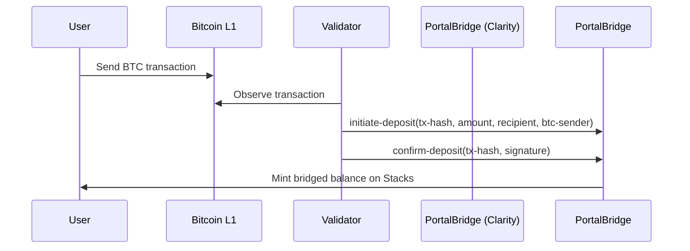
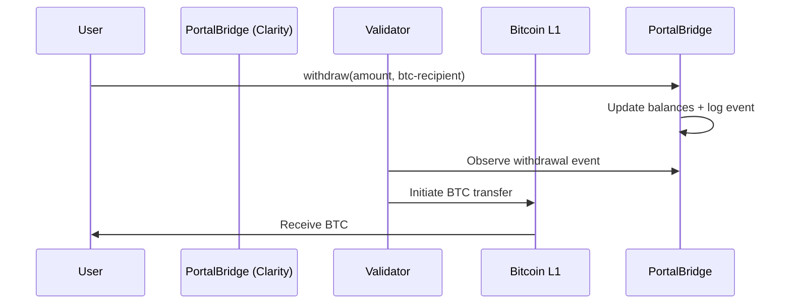

# PortalBridge Protocol

### Revolutionary Cross-Chain Infrastructure for the Bitcoin–Stacks Ecosystem

---

## 📖 Overview

**PortalBridge** is a **secure, decentralized cross-chain protocol** that enables trustless asset transfers between **Bitcoin’s base layer (L1)** and **Stacks Layer 2 (L2)**. By combining Bitcoin’s security with Stacks’ programmability, PortalBridge establishes the foundation for scalable, enterprise-grade cross-chain applications.

The protocol leverages **validator-based consensus**, **cryptographic signature validation**, and **autonomous smart contracts** to deliver **real-time, trust-minimized interoperability**.

Key features include:

* ⚡ **Seamless Cross-Chain Transfers** — Bitcoin to Stacks and back
* 🔐 **Multi-Validator Security** — distributed confirmation mechanism
* ⏱ **Automated Settlement** — trustless minting/burning of bridged assets
* 🛡 **Dynamic Risk Management** — emergency pause and recovery mechanisms
* 📊 **Audit-Ready State** — complete on-chain records of deposits, balances, and validator actions

---

## 🏗 System Overview

PortalBridge operates as a **two-way peg system** between Bitcoin and Stacks:

1. **Deposit (BTC → Stacks)**

   * User sends BTC on Bitcoin L1.
   * Validators observe and verify the transaction.
   * Deposit record is created on Stacks smart contract.
   * After sufficient confirmations, assets are minted on Stacks as bridged balances.

2. **Withdraw (Stacks → BTC)**

   * User burns/moves bridged tokens via the contract.
   * Withdrawal event is logged on-chain.
   * Validators monitor and relay to Bitcoin for settlement.

3. **Security Controls**

   * Emergency pause and recovery mechanisms safeguard funds.
   * Multi-sig validator consensus ensures decentralization.
   * Validation checks (signatures, tx hashes, BTC addresses) prevent spoofing.

---

## ⚙️ Contract Architecture

The protocol is implemented fully in **Clarity smart contracts** and structured as follows:

### **Traits**

* **`bridgeable-token-trait`** — defines the transferable/mintable interface for bridged assets.

### **Core Components**

* **Deposits Map** — tracks BTC deposits (amount, sender, recipient, confirmations).
* **Validator Set** — authorized principals responsible for cross-chain confirmations.
* **Validator Signatures Map** — cryptographic proofs of validator approvals.
* **Bridge Balances Map** — user balances of bridged assets on Stacks.

### **Administrative Controls**

* `initialize-bridge` / `pause-bridge` / `resume-bridge` — lifecycle management.
* `add-validator` / `remove-validator` — dynamic validator set management.
* `emergency-withdraw` — protocol-level recovery.

### **Core Bridge Functions**

* `initiate-deposit` — records new Bitcoin deposits.
* `confirm-deposit` — validator-based consensus to finalize deposits.
* `withdraw` — user-initiated transfer back to Bitcoin.

### **Validation Helpers**

* `is-valid-principal` — ensures non-system principal addresses.
* `is-valid-btc-address` — enforces BTC address constraints.
* `is-valid-tx-hash` — validates Bitcoin transaction hashes.
* `is-valid-signature` — cryptographic format enforcement.
* `validate-deposit-amount` — ensures deposits remain within safe bounds.

---

## 🔄 Data Flow

Below is a high-level illustration of the **cross-chain deposit flow**:



And the **withdrawal flow**:



---

## 🔑 Security Model

* **Validator Consensus** — Only authorized validators can confirm deposits.
* **Multi-Signature Validation** — Ensures distributed trust.
* **Rate-Limiting & Bounds** — Enforced min/max deposit amounts.
* **Emergency Controls** — Ability to pause operations and recover assets.
* **Auditability** — Full event and state trail available on-chain.

---

## 📜 Deployment & Usage

1. **Bridge Initialization**

   ```clarity
   (contract-call? .portal-bridge initialize-bridge)
   ```

2. **Adding Validators**

   ```clarity
   (contract-call? .portal-bridge add-validator 'SP...validator)
   ```

3. **Initiating Deposit**

   ```clarity
   (contract-call? .portal-bridge initiate-deposit 0x<tx-hash> u100000 'SP...recipient 0x<btc-pubkey>)
   ```

4. **Confirming Deposit**

   ```clarity
   (contract-call? .portal-bridge confirm-deposit 0x<tx-hash> 0x<signature>)
   ```

5. **Withdraw to Bitcoin**

   ```clarity
   (contract-call? .portal-bridge withdraw u50000 0x<btc-address>)
   ```

---

## 📌 Notes

* The **contract deployer** acts as the initial administrator.
* Validators are critical actors — misbehavior can be mitigated by revocation.
* This implementation provides the **foundation layer**; production deployments should integrate with **off-chain relayers**, **monitoring infrastructure**, and **formal audits**.

---

## 📄 License

PortalBridge is released under the **MIT License**.
